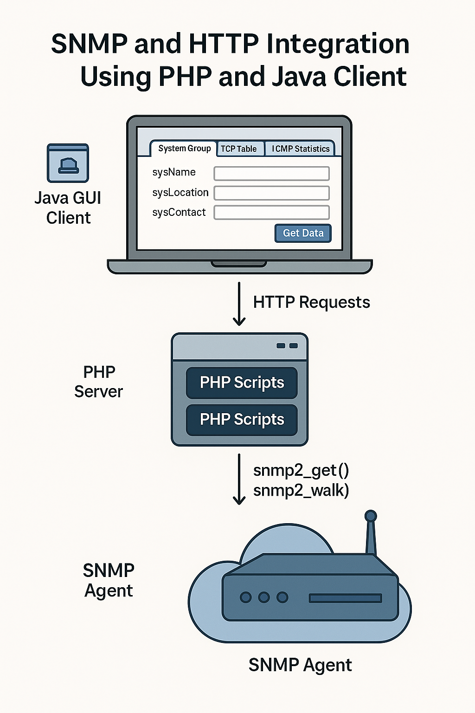

# 📄 SNMP and HTTP 

**Department:** Computer Engineering  
**Course:** Computer Networks 2 (10636455)  
**Instructor:** Dr. Raed Alqadi  
**Semester:** Spring 2025  
**Assignment:** #2

---

## 📌 Project Title  
**SNMP and HTTP Integration Using PHP and Java Client**

---

## 📚 Description  
This project aims to create an SNMP Manager using PHP and a Java Client that communicates with PHP via HTTP requests. The project involves collecting SNMP data (System, TCP, ICMP) and providing a simple user interface for interaction and editing.

---

## 🛠️ Technologies Used  
- **PHP** (Pure, no HTML inside PHP)  
- **Java** (HTTP Client with GUI Tabs)  
- **HTML/CSS** (Pages & styling)  
- **JavaScript** (AJAX or Fetch API)  
- **SNMP** (`snmp2_get`, `snmp2_walk`)  
- **XAMPP/WAMP**

---

## 🔧 Part 1: PHP Web Interface

### 🌐 Pages Overview

#### 📄 Page 1: System Group  
- Display all system group items except `System Services`
- Editable fields: `sysContact`, `sysName`, `sysLocation`
- SNMP community must be set to allow **read/write**

#### 📄 Page 2: TCP Connections  
- Display current TCP connection table

#### 📄 Page 3: ICMP Statistics  
- Display SNMP ICMP group statistics using:
  - `snmp2_get()` in a loop  
  - `snmp2_walk()`  
- Show results in **two side-by-side tables**
- Strip out types like `Counter32`, `INTEGER`

### 🧭 Navigation  
- Add **Next / Previous** between pages  
- Optional: Create a **Main Dashboard**

---

## 🔧 Part 2: Java Client via HTTP

### 🖥️ GUI Tabs
- **Tab 1:** System Group  
- **Tab 2:** TCP Table  
- **Tab 3:** ICMP Statistics  

### ☁️ Behavior
- Java sends HTTP requests to PHP scripts  
- PHP fetches SNMP data and returns raw values (no HTML)  
- Java displays responses in the GUI  
- Each tab includes a **"Get Data"** button  
- Editable fields on Tab 1 should include buttons for updates  

